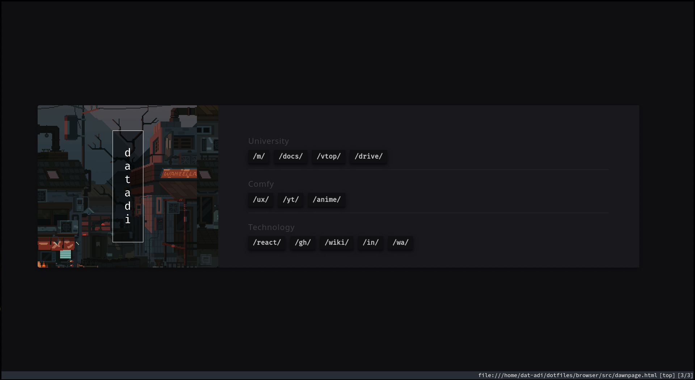
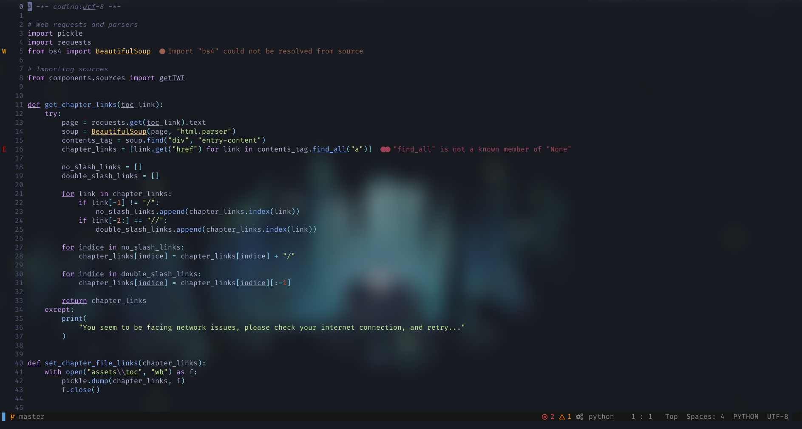
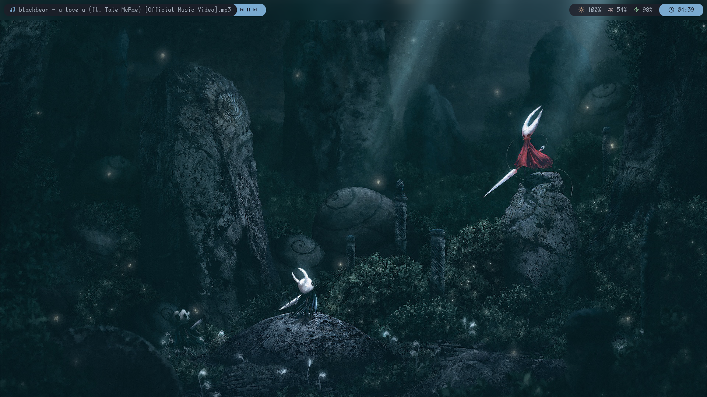

# Config Notes

A repository to contain the configuration files of my editors, and settings of the IDEs as well. Maybe a bit more.

## 27/06/2020

It really only just contains my configurations of my .vimrc, and maybe I'll add in my emacs config once I get the hang of it as well.

## 19/04/2021

I've converted to Arch Linux.

I've connected bunch of my files required for my configuration into this repository.
At this point, the config consists of a large number of applications, and software, ranging from fish to vim, to tmux, to qtile, to DOOM Emacs.

I can probably say that it wouldn't be too much of a hassle to get my setup back, on a new computer of Arch Linux, with a simple git pull and configure using symlinks at this point.

## 30/04/2021

Discovered [dotbot](https://github.com/anishathalye/dotbot#getting-started).
My setup only continues to be easier to set up.

At this point, all I need to do in order to set myself back up, would be a simple few lines.

```shell
git clone git@github.com:dat-adi/dotfiles.git
cd dotfiles
./install
```

That's it!
Just three lines to get back a setup worth of config files, efficiency!

## 07/05/2021

Managed to modularize the qtile config files, splitting up the code into separate Managers for each section.\
Added [starship](https://starship.rs) as my cross-shell prompt, for uniformity in the different shells.\
Installed [colorscripts](https://aur.archlinux.org/packages/shell-color-scripts/), enabled them on startup for fun, and added Hollow Knight ASCII art to startup_scripts for [fm6000](https://github.com/anhsirk0/fetch-master-6000) as well. Might work on it later.

Added Rust replacements for various features related to command line.

-   [Alacritty](https://github.com/alacritty/alacritty) : Terminal.
-   [Starship](https://starship.rs) : Cross-shell Prompt.
-   [Bat](https://github.com/sharkdp/bat) : Replacement for the `cat` command.
-   [Exa](https://github.com/ogham/exa) : Replacement for the `ls` command.
-   [Ripgrep](https://github.com/BurntSushi/ripgrep) : Replacement for the `grep` command.
-   [Procs](https://github.com/dalance/procs) : Replacement for the `ps` command.

Finally, used the [.bash_profile](https://github.com/dat-adi/dotfiles/blob/master/bash_profile) file in order to split up the [.bashrc](https://github.com/dat-adi/dotfiles/blob/master/bashrc) into separate files.\
Helps in keeping it clean with a separate files for [functions](https://github.com/dat-adi/dotfiles/blob/master/.functions) and [aliases](https://github.com/dat-adi/dotfiles/blob/master/.bash_aliases).

I suppose this update arc could be considered to be focused on Modularization and Rust replacements.

## 19/05/2021

I've set up a new homepage for my browser, which is, [qutebrowser](https://qutebrowser.org/).\
It has been inspired from, and is a condensed down version of the [dawn](https://github.com/b-coimbra/dawn) homepage by b-coimbra.\
While I did set out making one for myself, I really did like the dawn version, so, it's just a simpler version of it.



The required assets for the homepage are present in the `browser` directory, in the case that you wish to implement them in your browser as well.\
Along with that, I've also placed all the packages that I use in the `packages.txt`, still need to sort it out into Pacman specific and AUR specific packages.

**Keep in mind that these commands are DANGEROUS**
Setting up all the required dependencies for my Arch Linux configuration can now be done with a simple shell script, that takes care of the pacman packages.\
This record will be updated in the case that I manage to make a version for the `yay` packages as well.

Here's the recovery configuration,

```shell
git clone git@github.com:dat-adi/dotfiles.git
cd dotfiles
./pac-packages
./install
```

That should get you to a working system setup without an issue.\
If the scripts do not execute, check if you've given it permissions to act as an executable in the first place.\
Use `chmod 755 filename` in this case.

## 08/10/2021

I generally note down things in `doom emacs` nowadays however, so, if there's not much of an update with respect to the progress I've made in life,
chances are that I've logged some of the progress in there. \
Either that, or I'm just really lazy and I haven't done anything great to update the logbook at all.

As of today, I've progressed a bit farther down the glory of the neovim text editor. \
What have I gotten myself into?

Neovim + Lua + LSP. \
I've heard about lua support and the lsp integration in neovim set ups a while back, like all the back when it first came out. \
But, for whatever reason, I wasn't quite able to make the time to check it out.

Now, I have, and it's really cool. \
I've installed the [Telescope](https://github.com/nvim-telescope/telescope.nvim) plugin, and damn, is it good. \
I'm proceeding towards checking out an LSP as well, and most likely, will be going forward with [pyright](https://github.com/microsoft/pyright).

However, this is but a simple discovery of profound technology. \
The updates to my neovim configuration, should include these changes in the form of documentation (most likely).

**update**: Yup, I ended up changing my theme, and utilizing LSP. \
I did find LSP integration really annoying due to the way it displayed the errors.

Switching over to the `palenightfall` theme did wonders to resolving that issue, however. \
It still feels a tad bit off, but, I suppose that's just because I'm not used to the way it looks now.



## 20/01/2022

For some odd reason, today, I felt the compulsion to switch my Window Manager to BSPWM, because I really wanted to switch up my workspace after a while.\
As such, I went online to, well, `r/unixporn` just to find [Saimoomedit's BSPWM Rice](https://github.com/saimoomedits/bspwm-first-rice), and considering that it
looked really clean, I figured that it was time to fix the configuration that I've set up for BSPWM.

The amount of stuff I fixed towards, blows my mind.\
Referencing saimoo's rice, I managed to fix a few issues that was really bugging me from the initial days of working with Arch Linux.

-   MPD :: I finally managed to fix mpd, simply by getting rid of the template configuration and actually going through the file, discarding what was not required.
-   Polybar :: Managed to rip off Saimoo's rice, and get it to work! However, I think I'll strip most of the rice at a later point and only include the time, and battery percent.

A few forum answers that helped me out here a bit were, \
[Failed to bind the mpd service](https://bbs.archlinux.org/viewtopic.php?id=120371) \
[Can't find any song in mpc](https://bbs.archlinux.org/viewtopic.php?id=205408)

My LSP configuration in Neovim seems to have completed broken down, so, that's quite unfortunate, but, that's something for another day perhaps. \
Figured that I might as well switch up my wallpaper as well, it's been a while.



---

<p align="right"><i>dat-adi</i></p>
